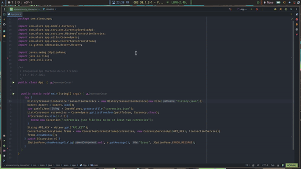
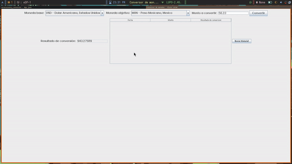

# CURRENCY CONVERTER

Conversor de monedas utilzando la API [ExchangeRateApi](https://app.exchangerate-api.com/dashboard),
segundo proyecto parte de los challenges propuestos en [#AluraLatam](https://www.aluracursos.com/)
con [#OracleNexEducation](https://app.aluracursos.com/form-one/registro/latam-general),
en la formación de **Java Orientado a Objetos G6 - ONE**

# ✨ Features

- 📋 Variables de entorno con [Dotenv Java](https://github.com/cdimascio/dotenv-java).
- 🚀 Manejo de objetos json con [Gson](https://github.com/google/gson)
- 💻 Interfaz grafica con Java Swing con diseño FlowLayout.
- 🔎 Manejo de excepciones.
- 📁 Historial de conversiones en un JTable ( manejo de ficheros).
- 📚 Manejo de estructuras de datos List, Vector, ArrayList.
- 💪 Peticiones http asincronas (trae una pequeña animación).
- 🛠️Lista personalizable de codigos de monedas.
- 📦 Manejo de dependencias con maven.

### Ejución del proyecto

### Agregar mas monedas


# ⚡️ Notas de ejecución

A continuación se daran las instrucciones para ejecutar al aplicación en modo desarrollo
Es necesario tener instalado [Java](https://www.java.com/es/download/ie_manual.jsp) y
opcionalmente [Maven](https://maven.apache.org/download.cgi).
Maven ya viene integrado en algunos IDE'S como Netbeans ó Intellij IDEA,
sin embargo a continuación un tutorial rapido
de [como instalar Maven](https://www.youtube.com/watch?v=biBOXvSNaXg&list=PLvimn1Ins-40atMWQkxD8r8pRyPLAU0iQ&index=2&ab_channel=MitoCode).

### 1. Inicializar el proyecto

- Clonar el repositorio
  ``` bash
  git clone https://github.com/OscarDevCPP/socacurrency-converter.git
  ```

- Copiar archivo .env.example con nuevo nombre .env <br>
  Dentro del proyecto existe un archivo con el nombre ".env.example", se debe
  hacer una copia de este archivo dentro del mismo directorio con el nuevo nombre ".env"
  **Importante, no olvidar el punto '.' es parte del nombre del archivo.** <br>
  **Alternativamente**, se puede ejecutar el siguiente comando.
  ``` bash
  cp .env.example .env
  ```

### 2. Obtener la API KEY gratuita

- Solicitar la API KEY en el sitio oficial de [ExchangeRateApi](https://www.exchangerate-api.com/).
- Modificar la propiedad API-KEY dentro del archivo ".env" <br>
  ``` dotenv
  API-KEY=AQUI_VA_TU_API_KEY
  ```

### 3. Ejecutar la aplicación.

Esto se puede hacer con el IDE de turno (Intellij Idea u otro).

**Alternativamente (Solo si se tiene maven instalado)** se puede ejecutar desde consola utilizando los siguientes
comandos.

- Compilar la aplicacion
  ``` bash
  mvn clean compile
  ```
- Ejecutar la aplicación, gracias al plugin de maven [Exec Maven Plugin](https://www.mojohaus.org/exec-maven-plugin/).
  ``` bash
  mvn exec:java
  ```

# 🌈 ¿Como agrego mas códigos de monedas?

Dentro de la carpeta **"src/main/resources/com/alura/app/assets"** dentro del proyecto, se
encuentra el archivo **"currencies.json"**. Los códigos soportados se encuntran 
en la documentación de [ExchangeRateApi](https://www.exchangerate-api.com/docs/supported-currencies).

Dentro del archivo "currencies.json" veremos algo similar a lo siguiente:

``` json
[
  {
    "code": "USD",
    "name": "Dolar Americano",
    "country": "Estados Unidos"
  },
  {
    "code": "PEN",
    "name": "Sol Peruano",
    "country": "Perú"
  },
  {
    "code": "ARS",
    "name": "Peso Argentino",
    "country": "Argentina"
  },
  {
    "code": "MXN",
    "name": "Peso Mexicano",
    "country": "Mexico"
  },
  {
    "code": "BRL",
    "name": "Real Brazileño",
    "country": "Brazil"
  },
  {
    "code": "EUR",
    "name": "Euro",
    "country": "Unión Europea"
  },
  {
    "code": "CNY",
    "name": "Renminbi Chino",
    "country": "China"
  },
  {
    "code": "COP",
    "name": "Peso Colombiano",
    "country": "Colombia"
  },
  {
    "code": "INR",
    "name": "Rupia India",
    "country": "India"
  }
]
```

Dentro de este archivo se puede agregar mas objetos json que cumplan con la estructura siguiente:

``` json
{
 "code": "INR",
 "name": "Rupia India",
 "country": "India"
}
```
Donte:
- code es el codigo de moneda según los [códigos soportados](https://www.exchangerate-api.com/docs/supported-currencies).
- name es el nombre de la moneda (Puedes ser cualquier nombre).
- country es el pais de la moneda.